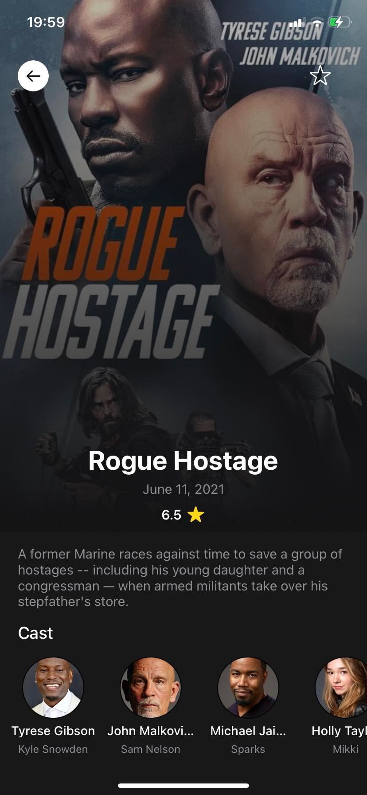

# MovieApp

MovieApp is a mobile application for show some ios skills, this app use Swift, RxSwift, Sqlite3 and MVVM.

## Getting Started

### Installation

Clone the project and next use the command line `pod install` to download the app dependencies

```bash
# clone the repository
git clone https://github.com/gvillegasc/movieapp-swift

# move to the cloned repository
cd movieapp-swift

# get dependencies
pod install
```

### Usage

Next to download dependencies you have to connect a device or simulator and execute the project.

### App images

<table>
    <tr>
        <th>App</th>
        <th>Movies</th>
    </tr>
	<tr>
        <td></td>
        <td></td>
	</tr>
    <tr>
        <th>Movie Detail</th>
        <th>Favorite Movies</th>
    </tr>
	<tr>
        <td></td>
        <td></td>
	</tr>
</table>
